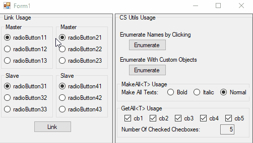

# csharp-utils
## Usage Demo

Useful C# extensions for windows form applications.


## Installation Nuget Package [Download](https://www.nuget.org/packages/CSUtils.LinkExtension.LinkControlByPropertyName)


Package Manager:

```sh
Install-Package CSUtils.LinkExtension.LinkControlByPropertyName -Version 1.0.0.2
```

.Net CLI:

```sh
dotnet add package CSUtils.LinkExtension.LinkControlByPropertyName --version 1.0.0.2
```

## Usage example

### Link/Unlink Windows Form Control Objects 
```csharp
private void LinkOneWay()
{
    // when checkbox2 and checkbox3 change their properties checkbox1 is not updated.
    checkbox1.LinkOneWay("Checked", checkbox2, checkbox3);
}

private void LinkBothWay()
{
    // all checkboxes are linked together by their "Checked" property.
    checkbox1.Link("Checked", checkbox2, checkbox3);
}

private void Unlink()
{
    checkbox1.UnLink();
}
```

### Button Enumerator
```csharp
private Dictionary<string, object> namesWithColors = new Dictionary<string, object>()
{
    { "Red" , Color.MediumVioletRed },
    { "Yellow" , Color.Yellow },
    { "Green" , Color.LightGreen },
};

private void bt_shift_names_with_colors_Click(object sender, EventArgs e)
{
    Button bt = sender as Button;
    bt.Enumerate(namesWithColors, (s, o) => {
        Color newColor = (Color)o;
        bt.BackColor = newColor;
        Console.WriteLine("new color is {0}", newColor.Name);
    });
}
```

### MakeAll
```csharp
private void Form1_Load(object sender, EventArgs e)
{
    // sample usage of MakeAll<T> extension to make all checkboxes checked: true on initialization
    this.MakeAll<CheckBox>(cb => cb.Checked = true);
}
```

### GetAll 
```csharp
private void Form1_Load(object sender, EventArgs e)
{
    // sample usage of GetAll<T> extension to select all radiobuttons which are defaulted by their tag
    foreach (RadioButton rb in this.GetAll<RadioButton>().Where(r => r.Tag.ConvertWithDefault<int>() == 0))
    {
        rb.Checked = true;
    }
}
```

## Development setup

After Downloading project, build 'BuilAll' project and use generated DLL file in your projects.

## Meta

Oğuzhan Katlı – [LinkedIn: ogzhnktl](https://www.linkedin.com/in/ogzhnktl) – oguzhankatli@gmail.com

Distributed under the MIT license. See ``LICENSE`` for more information.

[https://github.com/nixiz/csharp-utils](https://github.com/nixiz/csharp-utils/)

## Contributing

1. Fork it (<https://github.com/nixiz/csharp-utils/fork>)
2. Create your feature branch (`git checkout -b feature/fooBar`)
3. Commit your changes (`git commit -am 'Add some fooBar'`)
4. Push to the branch (`git push origin feature/fooBar`)
5. Create a new Pull Request

<!-- Markdown link & img dfn's -->
[npm-image]: https://img.shields.io/npm/v/datadog-metrics.svg?style=flat-square
[npm-url]: https://npmjs.org/package/datadog-metrics
[npm-downloads]: https://img.shields.io/npm/dm/datadog-metrics.svg?style=flat-square
[travis-image]: https://img.shields.io/travis/dbader/node-datadog-metrics/master.svg?style=flat-square
[travis-url]: https://travis-ci.org/dbader/node-datadog-metrics
[wiki]: https://github.com/yourname/yourproject/wiki
